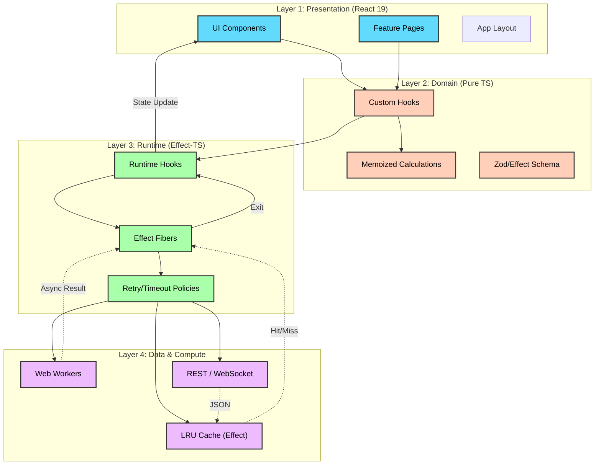
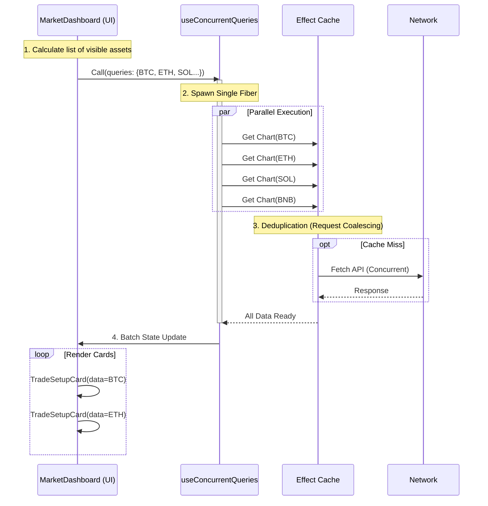
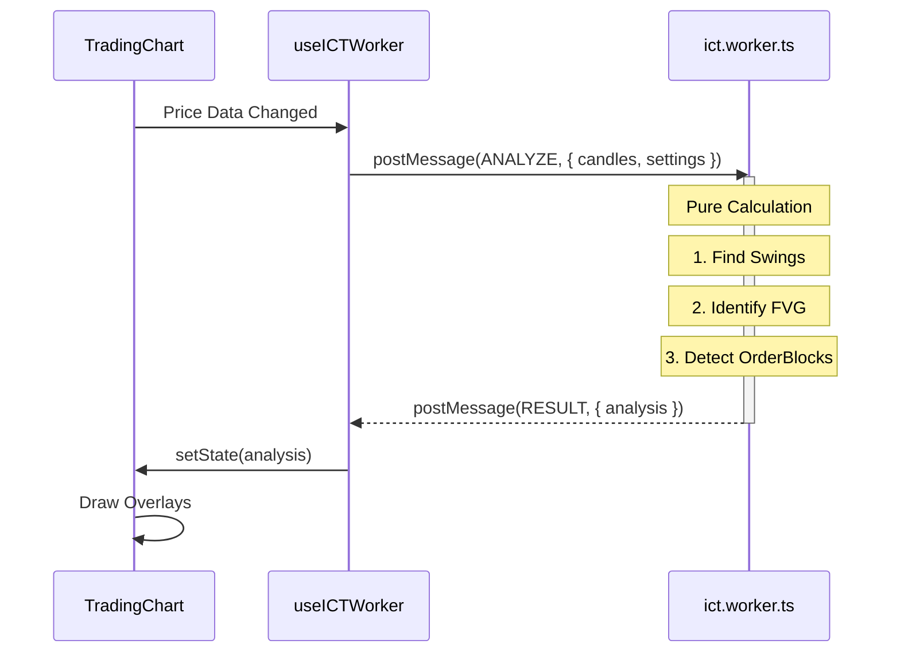

# Frontend Architecture & Core Mechanics

> **System:** `@0xsignal/app`
> **Stack:** React 19, TypeScript, Effect-TS, Vite, TailwindCSS
> **Paradigm:** Functional Programming (Pure Domain, Managed Side-Effects)

---

## 1. Architectural Layers

The application is structured into four distinct layers to enforce separation of concerns and functional purity.



---

## 2. Directory Structure (Feature-Based)

We adopt a "screaming architecture" where top-level folders represent features, not technical types.

```text
packages/app/src/
├── core/                   # Shared technical foundation
│   ├── cache/              # Effect-TS Cache implementations
│   ├── runtime/            # React <-> Effect bridges (hooks)
│   ├── utils/              # Pure utility functions
│   └── workers/            # Legacy/Shared workers
├── features/               # Feature domains
│   ├── chart/              # Charts, Indicators, Drawing Tools
│   │   ├── components/
│   │   ├── hooks/
│   │   ├── ict/            # ICT Concepts Logic (Inner Domain)
│   │   └── wyckoff/        # Wyckoff Logic (Inner Domain)
│   ├── dashboard/          # Market Dashboard
│   ├── asset-detail/       # Asset specific views
│   └── error/              # Error boundaries
└── components/             # Generic UI Kit (Buttons, Cards)
```

---

## 3. Core Mechanics: The React-Effect Bridge

The heart of our performance and reliability lies in how we bridge React's lifecycle with Effect's Runtime. We rarely write `useEffect` manually. Instead, we use specialized hooks.

### 3.1 `useEffectQuery` (The Bridge)

Connects a component to a `Fiber`.

- **Mount**: Spawns a fiber via `Runtime.runFork`.
- **Deps Change**: Interrupts old fiber, starts new one.
- **Unmount**: Interrupts fiber to cancel network/compute.

### 3.2 `useConcurrentQueries` (The Accelerator)

Solves the "N+1 Problem" by batching Effects.

- **Input**: A map of Effect creators (e.g., `{ btc: () => fetch(), eth: () => fetch() }`).
- **Execution**: Uses `Effect.all(effects, { concurrency: 'unbounded' })` to execute all in parallel efficiently.
- **Output**: Updates React state once with all results.

---

## 4. Sequence Diagrams: Optimization Flows

### 4.1 Concurrent Data Fetching (Market Dashboard)

How we load 12+ sparkline charts instantly without freezing the UI.



### 4.2 Web Worker Offloading (Heavy Compute)

How we keep the UI "blazing fast" while calculating complex indicators (ICT, Wyckoff).



---

## 5. Coding Standards & Principles

### Functional Purity

- **Components**: Should be pure functions of their props. Avoid internal state unless it's strictly UI state (e.g., "isDropdownOpen").
- **Logic**: Extract complex logic into pure functions in `utils` or `logic` files. Test these in isolation.

### Effect-TS Usage

- **No Promise**: Avoid raw `Promise` or `async/await` in domain logic. Use `Effect`.
- **Error Handling**: Use `Effect<Success, Error>` to strongly type errors.
- **Resilience**: Wrap network calls with `Effect.retry` (exponential backoff) and `Effect.timeout`.

### Performance Rules

1.  **No N+1**: Use `useConcurrentQueries` for lists.
2.  **Memoize**: Rely on React Compiler, but use `memo` for list items (`SignalCard`).
3.  **Virtualize**: If a list is > 50 items, use virtualization (though currently we limit via `useResponsiveDataCount`).
4.  **Offload**: Anything taking > 5ms goes to a Web Worker.

---

## 6. CSS & Design System

- **Engine**: TailwindCSS (Utility-first).
- **Theming**: CSS Variables defined in `index.css` (`--background`, `--foreground`).
- **Animations**: Custom keyframes (`animate-in`, `slide-in-from-bottom`) with `ease-premium` curves.

```css
/* Example: Premium Ease */
.ease-premium {
  transition-timing-function: cubic-bezier(0.4, 0, 0.2, 1);
}
```
