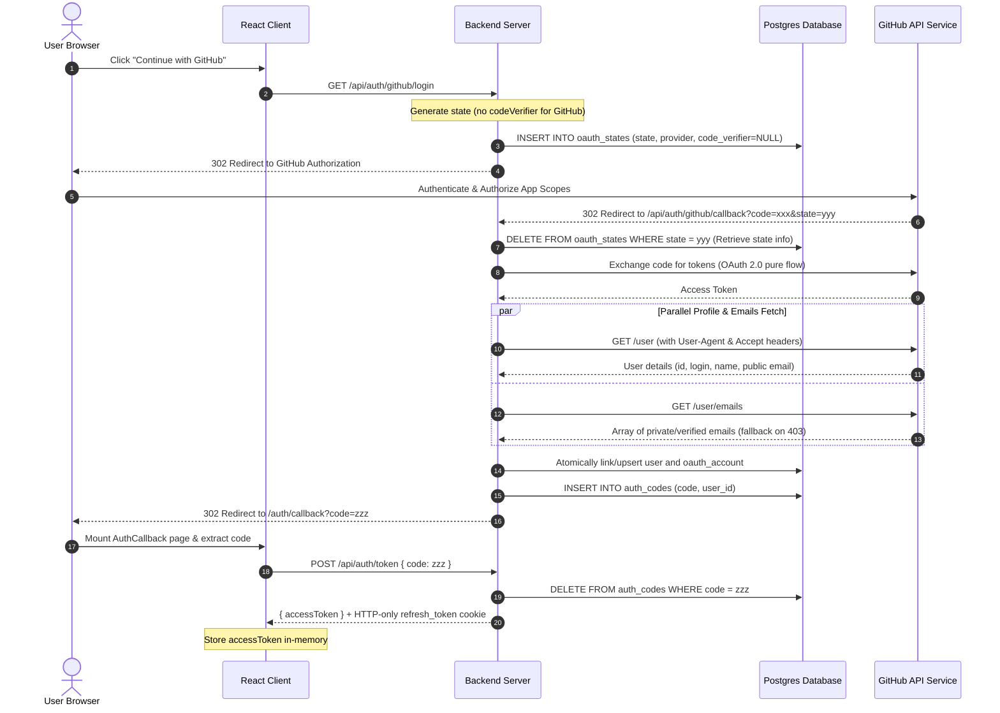

# GitHub OAuth 2.0 (No PKCE & Resilient Fetch) End-to-End Flow

This document details the step-by-step execution path of the GitHub OAuth login flow.

---

## Step-by-Step Execution Path

### 1. Initiate Login

- **Frontend Action**: User clicks the "Continue with GitHub" button, triggering a redirection to the login endpoint.
- **Backend Route**: The HTTP request hits the `/api/auth/:provider/login` route.
- **State Generation**: The backend retrieves the GitHub configuration and generates a random CSRF `state`.
  - **No PKCE**: Unlike Google, GitHub OAuth Apps do not support PKCE. The provider sets the code verifier to null.
- **State Storage**: The generated `state`, `provider`, and a null code verifier are inserted into the database state table. A backward-compatible layer maps null to an empty string placeholder to satisfy non-null column constraints.
- **Redirection**: The server returns a redirection to GitHub with the state and requested scopes (`user:email`, `read:user`).

### 2. Authorization Callback

- **Callback**: After authentication, GitHub redirects the browser to the callback route with the auth code and state parameters.
- **State Validation**: The backend deletes and retrieves the stored state details from the database to prevent CSRF and replay attacks. It converts any empty string or SQL null values back into standard nulls dynamically.
- **Code Exchange**: The backend exchanges the authorization code using standard OAuth 2.0. No code verifier is sent.
- **Resilient Profile & Emails Retrieval**:
  - The backend fetches the public profile and the verified emails list in parallel, passing mandatory headers including User-Agent.
  - **Graceful Fallback**: If the emails endpoint returns a `403 Forbidden` (common under narrow permission scopes or when email permissions are restricted in App settings), the application catches the error and gracefully falls back to the public profile email field or null instead of raising a fatal crash.
- **User Upsert**: The backend atomically links or upserts the corresponding user and OAuth account records in the database, mapping the numeric user ID to a string representation.
- **One-Time Code**: The backend generates a temporary random auth code, stores it in the database with a 30-second TTL, and redirects the browser to the frontend callback landing page.

### 3. Secure Token Swap

- **Swapping**: The React landing page catches the code and calls the backend token exchange endpoint.
- **Code Deletion**: The backend deletes the code from the database immediately to prevent multiple exchanges or replay attempts.
- **JWT Issuance**: The server signs a short-lived access token and a long-lived refresh token.
- **Response**: The access token is returned in the response body. The rotated refresh token is set in a secure, HTTP-only, SameSite cookie scoped exclusively to the refresh endpoint.
