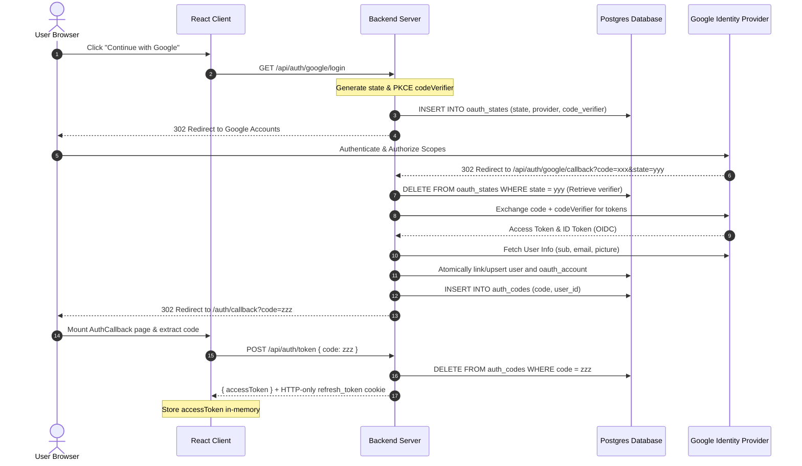

# Google OAuth 2.0 (with PKCE) End-to-End Flow

This document details the step-by-step execution path of the Google OAuth login flow.

---

## Step-by-Step Execution Path

### 1. Initiate Login

- **Frontend Action**: User clicks the "Continue with Google" button, triggering a redirection to the login endpoint.
- **Backend Route**: The HTTP request hits the `/api/auth/:provider/login` route.
- **State & Verifier Generation**: The backend retrieves the Google configuration and generates a random CSRF `state` and a PKCE `codeVerifier`.
- **State Storage**: The generated `state`, `provider`, and `codeVerifier` are inserted into the database state table.
- **Redirection**: The server returns a redirection to Google Accounts with the state, the code challenge, and requested scopes (`openid`, `profile`, `email`).

### 2. Authorization Callback

- **Callback**: After authentication, Google redirects the browser to the callback route with the auth code and state parameters.
- **State Validation**: The backend deletes and retrieves the stored state details from the database to prevent CSRF and replay attacks.
- **Code Exchange (PKCE)**: The backend calls Google's token endpoint to exchange the authorization code along with the matching code verifier.
- **Profile Retrieval**: Using the issued access token, the provider fetches user profile information from the Google user info endpoint.
- **User Upsert**: The backend atomically links or upserts the corresponding user and OAuth account records in the database.
- **One-Time Code**: The backend generates a temporary random auth code, stores it in the database with a 30-second TTL, and redirects the browser to the frontend callback landing page.

### 3. Secure Token Swap

- **Swapping**: The React landing page catches the code and calls the backend token exchange endpoint.
- **Code Deletion**: The backend deletes the code from the database immediately to prevent multiple exchanges or replay attempts.
- **JWT Issuance**: The server signs a short-lived access token and a long-lived refresh token.
- **Response**: The access token is returned in the response body. The rotated refresh token is set in a secure, HTTP-only, SameSite cookie scoped exclusively to the refresh endpoint.
